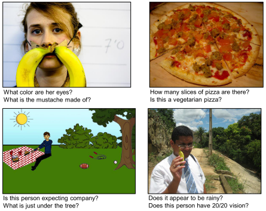

# Visual Question Answering

## 1. Problem Statement

Visual Question Answering (VQA) is a novel problem that lies at the intersection of the two most exciting fields of modern artificial intelligence and machine learning, namely, Computer Vision (CV) and Natural Language Processing (NLP). Over the past decades, we have seen significant advancements in both CV and NLP. While CV is trying to teach machines how to see, with tasks such as object detection, identification, and image captioning, and NLP trying to teach machines how to read, reason, and converse, VQA is an integration of the tasks from both fields. A VQA system takes an image and a question as inputs and outputs the answer to that question based on the input image. 

|
-|
*Examples of questions drawn from the VQA dataset.* [5] |

Both the input image and the question are free of a specific form and are open-ended. In order to answer the questions correctly, the VQR system would have to possess an extensive set of AI abilities. The system would first have to understand the question; for example, understanding questions such as "How many apples are there?" requires a numeric answer while questions like "Is there an apple?" requires a boolean answer. For more straightforward questions such as "what is the color of the house?" the system would have to have the ability to detect objects, and recognize certain activities. Moreover, it would need to reason based on existing knowledge and commonsense to answer questions that ask for information not explicitly presented in the image. Because of the rich set of challenges it poses, VQA is a difficult task that pushes the boundaries of AI research [5]. 

VQA is interesting because it is challenging and because of its close resemblance to human reasoning. After all, a large part of our daily task is to respond to what we see. We make decisions by asking ourselves relevant questions and then answer them using visual information. By solving VQA, we are inherently solving a large set of AI problems, and due to the general nature of VQA, it may be possible to transfer the results from VQA to other AI tasks.

## 2. Literature Review

Early attempts at this problem adopted a probabilistic approach. Malinowski *et al.* [1] proposed a system to answer questions about relations and counts of objects amongst indoor scenes using a bayesian framework. The system was trained on question-answer pairs that are both generated based on predefined templates and collected from human annotators. The results were evaluated using accuracy and a semantic similarity score between generated answer and the ground truth. 

The later attempts of visual question answering utilized a deep learning approach. Malinowski *et al.* [2] proposed a Neural-Image-QA, an end to end question answering model that combines CNN and LSTM. Questions were decomposed into individual words, and then embedded before concatenating with CNN image encodings. The question are being fed into the model word by word together with image encodings at every instance. The model would then predict the answer to the question one word at a time through LSTM until an *\<end\>* token is predicted. The paper adopted GoogleNet [3] as their CNN architecture, and pretrained it using the ImageNet dataset [4].

Agrawal *et al.* [5] created the VQA dataset consisting of real images from the MS COCO dataset [6], as well as abstract images generated using clipart dolls and backgrounds. The dataset contains both open-ended questions, multiple-choice questions, and corresponding answers, collected from human workers. Furthermore, The paper proposed an accuracy metric, making it easy for automated model evaluation and model comparison. In fact, many following research on VQA utilized the VQA dataset for model training, testing, and benchmarking.

Similar to Malinowski *et al.* [2], Agrawal *et al.* [5], implemented a CNN+LSTM multi-model structure for the VQA task. However, instead of concatenating image embeddings and word encodings together as input for the LSTM, and thus having the LSTM prediction dependent on CNN output; this paper proposed a structure that computes CNN and LSTM independently, then fusing them together before passing through a softmax layer to predict the answer. The predicted answers were chosen from a predefined set of 1000 most common answers. 

Shih *et al.* [7] proposed a VQA system for multiple choice questions with a region selection layer. It attempts to teach the system where to look in the image given a certain question. For example, when a question asks "Is it raining?", the model would focus on the umbrellas in the image. This is done by first selecting candidate regions in the image by using top-ranked Edge Boxes [8], then extracting features from each selected region using CNN. The features for each image regions are then merged with the question-answer embedding (produced by a pre-trained Word2Vec model) using dot product before passing through a softmax layer to produce per-region weights. The per-region weights are used to calculate the score of a given question-answer pair. The model is trained and tested using multiple choice questions from the VQA dataset [5], and has demonstrated improved performance in questions that require focusing on particular regions.

Building on the concept of image region attention [7], Lu *et al.* [9] proposed a co-attention model that adopted a question attention mechanism alongside image attention. The paper also proposed a hierarchical architecture for question representation with three levels, namely word level, phrase level, and question level. The model was trained and tested using both the VQA dataset [5] and COCO-QA dataset [10].

Recent developments of VQA systems have become more generalized, with research trying to solve multiple visual and language (V+L) problems, including VQA, VCR [13], and NLVR [14], using recent results from NLP and CV such as transformers [15] [16].

## 3. Applications

### 3.1 VQA for the visually impaired
One immediate application of VQA would be providing assistance to the visually impaired. For the visually impaired, a VQA system could be an assistive technology that gathers and processes visual information for them. For example, when crossing the road, a blind person could ask questions such as "Are there any cars coming down the road?" which would help the person cross the road safely. Or, when in a new environment, the person could ask the system: What is in front of me? And the system could provide a brief description of the surrounding. VQA has the potential to provide assistance to the visually impaired, which would help them reconnect with the world. 

A recent step in using VQA to help the blind was made by Gurari *et al.* [11], who proposed the VizWiz dataset that is dedicated to VQA problems that would arise in daily settings. The questions and answers were collected from blind people, who would take pictures and record questions about the pictures. The existence of the dataset encourages research in adoping VQA to helping the blind, as well as accelerate the development of commercially avilable assistive products for the blind community.

### 3.2 Medical VQA
Also, VQA could be used in medical image understanding and question answering. For medical staffs who analyses medical images and make diagnoses on a daily basis, a medical VQA system could make the process easier. Unlike other medical CV tasks that is confined to one specific task, medical VQA systems could respond to open-ended questions, making it potentially able to provide a second opinion to medical staffs, making diagnoses more accurate and more efficient. 

Li *et al.* [12] compared and analyzed four transformer-based V+L models trained on radiographs from the MIMIC-CXR dataset and corresponding clinical reports. The research had found that V+L transformer models outperformed existing CNN-RNN models on diagnosis tasks, and demonstrated that V+L models could highlight regions of interest in the radiographs, such as areas that demonstrated symptoms listed in the report.

## 4. Open-source Resources

Most of the codes and datasets are open-sourced by the research community. Some of them are listed below.

### 4.1 Datasets

| Datasets     | Link                                                           |
| ------------ | -------------------------------------------------------------- |
| ImageNet [4] | https://www.image-net.org                                      |
| VQA [5]      | https://visualqa.org                                           |
| COCO [6]     | https://cocodataset.org                                        |
| COCO-QA [10] | https://www.cs.toronto.edu/~mren/research/imageqa/data/cocoqa/ |
| VizWiz [11]  | https://vizwiz.org                                             |
| VCR [13]     | https://visualcommonsense.com                                  |
| NLVR [14]    | https://lil.nlp.cornell.edu/nlvr/                              |

### 4.2 Models

| Models            | Link                                                         | Liscence |
| ----------------- | ------------------------------------------------------------ | -------- |
| VQA-LSTM-CNN [5]  | https://github.com/GT-Vision-Lab/VQA_LSTM_CNN                | BSD      |
| HieCoAttenVQA [9] | https://github.com/jiasenlu/HieCoAttenVQA                    | -        |
| VisualBERT [15]   | https://github.com/uclanlp/visualbert/tree/master/visualbert | MIT      |
| LXMert [16]       | https://github.com/airsplay/lxmert                           | MIT      |

## 5. References

[1] M. Malinowski and M. Fritz, "A multi-world approach to question answering about real-world scenes based on uncertain input," Adv. Neural Inf. Process. Syst., vol. 2, no. January, pp. 1682–1690, 2014.

[2] M. Malinowski, M. Rohrbach, and M. Fritz, "Ask your neurons: A neural-based approach to answering questions about images," Proc. IEEE Int. Conf. Comput. Vis., vol. 2015 Inter, pp. 1–9, 2015, doi: 10.1109/ICCV.2015.9.

[3] C. Szegedy et al., "Going deeper with convolutions," Proc. IEEE Comput. Soc. Conf. Comput. Vis. Pattern Recognit., vol. 07-12-June, pp. 1–9, 2015, doi: 10.1109/CVPR.2015.7298594.

[4] O. Russakovsky et al., "ImageNet Large Scale Visual Recognition Challenge," Int. J. Comput. Vis., vol. 115, no. 3, pp. 211–252, 2015, doi: 10.1007/s11263-015-0816-y.

[5] S. Antol et al., "VQA: Visual question answering," Proc. IEEE Int. Conf. Comput. Vis., vol. 2015 Inter, pp. 2425–2433, 2015, doi: 10.1109/ICCV.2015.279.

[6] T. Y. Lin et al., "Microsoft COCO: Common objects in context," Lect. Notes Comput. Sci. (including Subser. Lect. Notes Artif. Intell. Lect. Notes Bioinformatics), vol. 8693 LNCS, no. PART 5, pp. 740–755, 2014, doi: 10.1007/978-3-319-10602-1_48.

[7] K. J. Shih, S. Singh, and D. Hoiem, "Where to look: Focus regions for visual question answering," Proc. IEEE Comput. Soc. Conf. Comput. Vis. Pattern Recognit., vol. 2016-Decem, pp. 4613–4621, 2016, doi: 10.1109/CVPR.2016.499.

[8] C. L. Zitnick and P. Dollár, "Edge boxes: Locating object proposals from edges," Lect. Notes Comput. Sci. (including Subser. Lect. Notes Artif. Intell. Lect. Notes Bioinformatics), vol. 8693 LNCS, no. PART 5, pp. 391–405, 2014, doi: 10.1007/978-3-319-10602-1_26.

[9] J. Lu, J. Yang, D. Batra, and D. Parikh, "Hierarchical question-image co-attention for visual question answering," Adv. Neural Inf. Process. Syst., pp. 289–297, 2016, [Online]. Available: https://arxiv.org/abs/1606.00061.

[10] M. Ren, R. Kiros, and R. S. Zemel, "Exploring models and data for image question answering," Adv. Neural Inf. Process. Syst., vol. 2015-Janua, pp. 2953–2961, 2015.

[11] D. Gurari et al., "VizWiz Grand Challenge: Answering Visual Questions from Blind People," Proc. IEEE Comput. Soc. Conf. Comput. Vis. Pattern Recognit., pp. 3608–3617, 2018, doi: 10.1109/CVPR.2018.00380.

[12] Y. Li, H. Wang, and Y. Luo, "A Comparison of Pre-trained Vision-and-Language Models for Multimodal Representation Learning across Medical Images and Reports," Proc. - 2020 IEEE Int. Conf. Bioinforma. Biomed. BIBM 2020, pp. 1999–2004, 2020, doi: 10.1109/BIBM49941.2020.9313289.

[13] R. Zellers, Y. Bisk, A. Farhadi, and Y. Choi, "From recognition to cognition: Visual commonsense reasoning," Proc. IEEE Comput. Soc. Conf. Comput. Vis. Pattern Recognit., vol. 2019-June, pp. 6713–6724, 2019, doi: 10.1109/CVPR.2019.00688.

[14] A. Suhr, M. Lewis, J. Yeh, and Y. Artzi, "A corpus of natural language for visual reasoning," ACL 2017 - 55th Annu. Meet. Assoc. Comput. Linguist. Proc. Conf. (Long Pap., vol. 2, pp. 217–223, 2017, doi: 10.18653/v1/P17-2034.

[15] L. H. Li, M. Yatskar, D. Yin, C.-J. Hsieh, and K.-W. Chang, "VisualBERT: A Simple and Performant Baseline for Vision and Language," no. 2, pp. 1–14, 2019, [Online]. Available: http://arxiv.org/abs/1908.03557.

[16] H. Tan and M. Bansal, "LXMert: Learning cross-modality encoder representations from transformers," EMNLP-IJCNLP 2019 - 2019 Conf. Empir. Methods Nat. Lang. Process. 9th Int. Jt. Conf. Nat. Lang. Process. Proc. Conf., pp. 5100–5111, 2020, doi: 10.18653/v1/d19-1514.